# BlendedMVS_lowres
### 58c4bb4f4a69c55606122be4
| Method | Novel View Synthesis |
|:---: |:---:|
| neus-colmap ||
|neuralangelo-colmap_sparse||
|neuralangelo-colmap_dense||

### 58cf4771d0f5fb221defe6da
| Method | Novel View Synthesis |
|:---: |:---:|
| neus-colmap |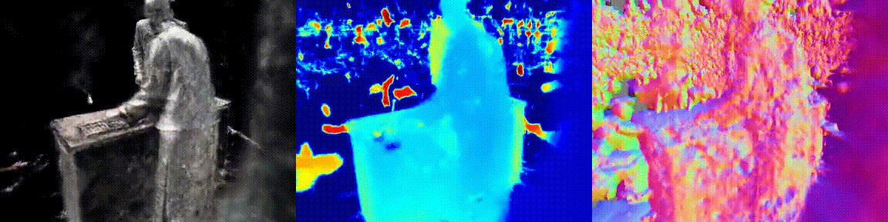|
|neuralangelo-colmap_sparse||
|neuralangelo-colmap_dense||

### 58d36897f387231e6c929903
| Method | Novel View Synthesis |
|:---: |:---:|
| neus-colmap ||
|neuralangelo-colmap_sparse||
|neuralangelo-colmap_dense||

### 58f7f7299f5b5647873cb110
| Method | Novel View Synthesis |
|:---: |:---:|
| neus-colmap |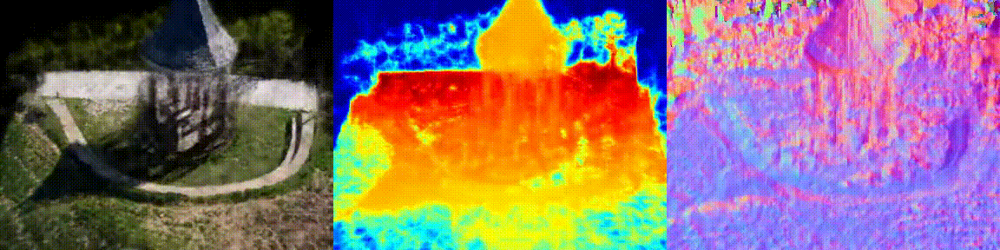|
|neuralangelo-colmap_sparse||
|neuralangelo-colmap_dense||

### 59056e6760bb961de55f3501
| Method | Novel View Synthesis |
|:---: |:---:|
| neus-colmap |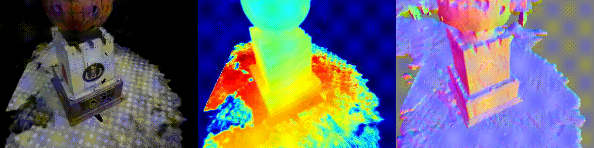|
|neuralangelo-colmap_sparse||
|neuralangelo-colmap_dense||

### 5947719bf1b45630bd096665
| Method | Novel View Synthesis |
|:---: |:---:|
| neus-colmap ||
|neuralangelo-colmap_sparse||
|neuralangelo-colmap_dense||

### 5947b62af1b45630bd0c2a02
| Method | Novel View Synthesis |
|:---: |:---:|
| neus-colmap |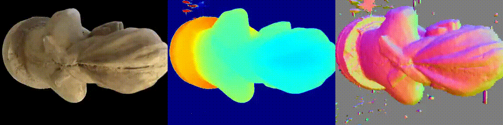|
|neuralangelo-colmap_sparse||
|neuralangelo-colmap_dense||

### 59817e4a1bd4b175e7038d19
| Method | Novel View Synthesis |
|:---: |:---:|
| neus-colmap |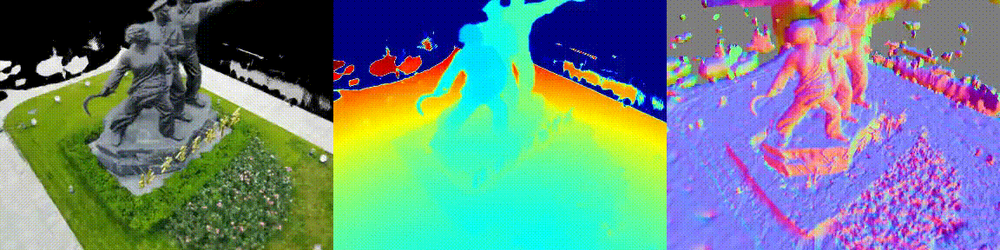|
|neuralangelo-colmap_sparse||
|neuralangelo-colmap_dense||

### 599aa591d5b41f366fed0d58
| Method | Novel View Synthesis |
|:---: |:---:|
| neus-colmap ||
|neuralangelo-colmap_sparse||
|neuralangelo-colmap_dense||

### 59e75a2ca9e91f2c5526005d
| Method | Novel View Synthesis |
|:---: |:---:|
| neus-colmap ||
|neuralangelo-colmap_sparse||
|neuralangelo-colmap_dense||

### 59f363a8b45be22330016cad
| Method | Novel View Synthesis |
|:---: |:---:|
| neus-colmap |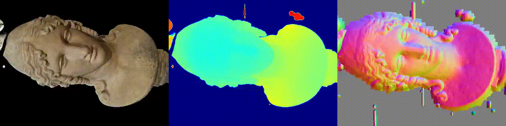|
|neuralangelo-colmap_sparse||
|neuralangelo-colmap_dense||

### 59f87d0bfa6280566fb38c9a
| Method | Novel View Synthesis |
|:---: |:---:|
| neus-colmap ||
|neuralangelo-colmap_sparse||
|neuralangelo-colmap_dense||

### 5a48c4e9c7dab83a7d7b5cc7
| Method | Novel View Synthesis |
|:---: |:---:|
| neus-colmap ||
|neuralangelo-colmap_sparse||
|neuralangelo-colmap_dense||

### 5a588a8193ac3d233f77fbca
| Method | Novel View Synthesis |
|:---: |:---:|
| neus-colmap ||
|neuralangelo-colmap_sparse||
|neuralangelo-colmap_dense||

### 5a8315f624b8e938486e0bd8
| Method | Novel View Synthesis |
|:---: |:---:|
| neus-colmap ||
|neuralangelo-colmap_sparse||
|neuralangelo-colmap_dense||

### 5aa0f9d7a9efce63548c69a1
| Method | Novel View Synthesis |
|:---: |:---:|
| neus-colmap ||
|neuralangelo-colmap_sparse||
|neuralangelo-colmap_dense||

### 5aa235f64a17b335eeaf9609
| Method | Novel View Synthesis |
|:---: |:---:|
| neus-colmap |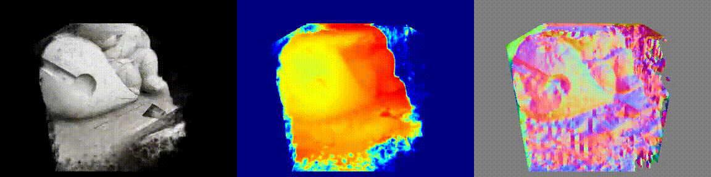|
|neuralangelo-colmap_sparse||
|neuralangelo-colmap_dense|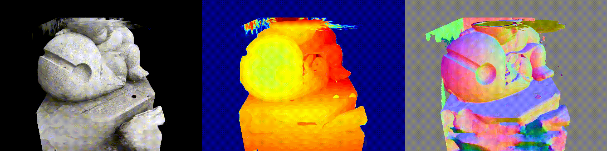|

### 5aa515e613d42d091d29d300
| Method | Novel View Synthesis |
|:---: |:---:|
| neus-colmap |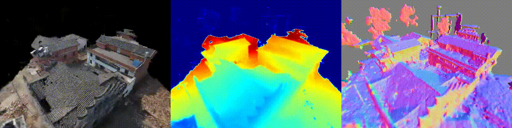|
|neuralangelo-colmap_sparse|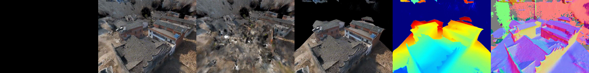|
|neuralangelo-colmap_dense||

### 5ab8713ba3799a1d138bd69a
| Method | Novel View Synthesis |
|:---: |:---:|
| neus-colmap |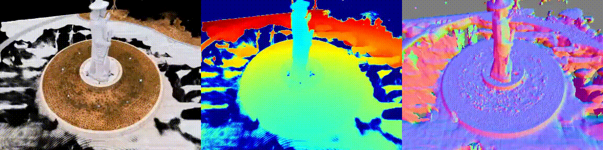|
|neuralangelo-colmap_sparse||
|neuralangelo-colmap_dense||

### 5acf8ca0f3d8a750097e4b15
| Method | Novel View Synthesis |
|:---: |:---:|
| neus-colmap |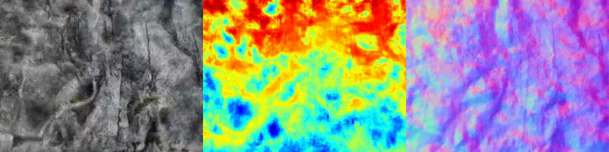|
|neuralangelo-colmap_sparse||
|neuralangelo-colmap_dense||

### 5adc6bd52430a05ecb2ffb85
| Method | Novel View Synthesis |
|:---: |:---:|
| neus-colmap ||
|neuralangelo-colmap_sparse||
|neuralangelo-colmap_dense||

### 5afacb69ab00705d0cefdd5b
| Method | Novel View Synthesis |
|:---: |:---:|
| neus-colmap ||
|neuralangelo-colmap_sparse||
|neuralangelo-colmap_dense||

### 5b08286b2775267d5b0634ba
| Method | Novel View Synthesis |
|:---: |:---:|
| neus-colmap ||
|neuralangelo-colmap_sparse||
|neuralangelo-colmap_dense||

### 5b271079e0878c3816dacca4
| Method | Novel View Synthesis |
|:---: |:---:|
| neus-colmap ||
|neuralangelo-colmap_sparse||
|neuralangelo-colmap_dense||

### 5b558a928bbfb62204e77ba2
| Method | Novel View Synthesis |
|:---: |:---:|
| neus-colmap ||
|neuralangelo-colmap_sparse||
|neuralangelo-colmap_dense||

### 5b60fa0c764f146feef84df0
| Method | Novel View Synthesis |
|:---: |:---:|
| neus-colmap |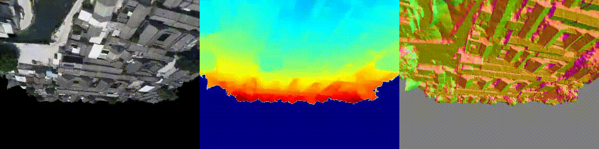|
|neuralangelo-colmap_sparse|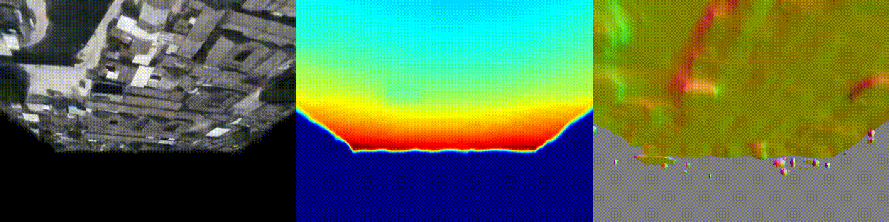|
|neuralangelo-colmap_dense||

### 5b62647143840965efc0dbde
| Method | Novel View Synthesis |
|:---: |:---:|
| neus-colmap ||
|neuralangelo-colmap_sparse||
|neuralangelo-colmap_dense||

### 5b69cc0cb44b61786eb959bf
| Method | Novel View Synthesis |
|:---: |:---:|
| neus-colmap ||
|neuralangelo-colmap_sparse||
|neuralangelo-colmap_dense||

### 5b6e716d67b396324c2d77cb
| Method | Novel View Synthesis |
|:---: |:---:|
| neus-colmap ||
|neuralangelo-colmap_sparse||
|neuralangelo-colmap_dense||

### 5b6eff8b67b396324c5b2672
| Method | Novel View Synthesis |
|:---: |:---:|
| neus-colmap |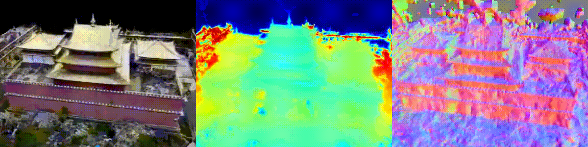|
|neuralangelo-colmap_sparse||
|neuralangelo-colmap_dense||

### 5b7a3890fc8fcf6781e2593a
| Method | Novel View Synthesis |
|:---: |:---:|
| neus-colmap |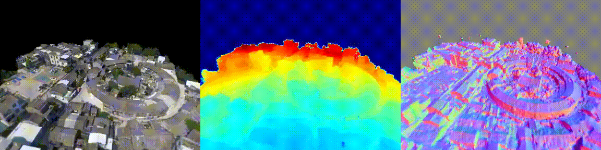|
|neuralangelo-colmap_sparse||
|neuralangelo-colmap_dense||

### 5ba75d79d76ffa2c86cf2f05
| Method | Novel View Synthesis |
|:---: |:---:|
| neus-colmap |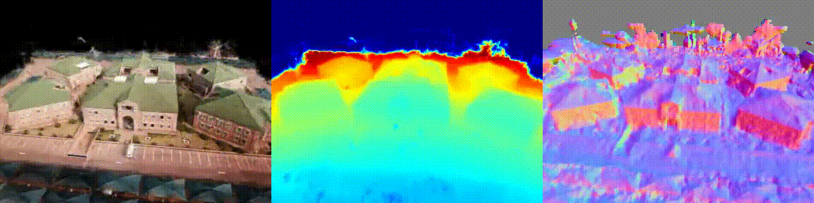|
|neuralangelo-colmap_sparse||
|neuralangelo-colmap_dense||

### 5bbb6eb2ea1cfa39f1af7e0c
| Method | Novel View Synthesis |
|:---: |:---:|
| neus-colmap ||
|neuralangelo-colmap_sparse||
|neuralangelo-colmap_dense||

### 5be3a5fb8cfdd56947f6b67c
| Method | Novel View Synthesis |
|:---: |:---:|
| neus-colmap ||
|neuralangelo-colmap_sparse||
|neuralangelo-colmap_dense||

### 5be3ae47f44e235bdbbc9771
| Method | Novel View Synthesis |
|:---: |:---:|
| neus-colmap |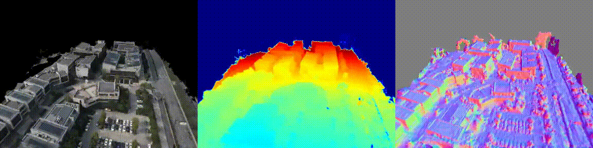|
|neuralangelo-colmap_sparse||
|neuralangelo-colmap_dense||

### 5bf17c0fd439231948355385
| Method | Novel View Synthesis |
|:---: |:---:|
| neus-colmap ||
|neuralangelo-colmap_sparse||
|neuralangelo-colmap_dense||

### 5bf26cbbd43923194854b270
| Method | Novel View Synthesis |
|:---: |:---:|
| neus-colmap ||
|neuralangelo-colmap_sparse||
|neuralangelo-colmap_dense||

### 5bfc9d5aec61ca1dd69132a2
| Method | Novel View Synthesis |
|:---: |:---:|
| neus-colmap ||
|neuralangelo-colmap_sparse||
|neuralangelo-colmap_dense||