# Instant-angelo_vis
Welcome to Instant-angelo_vis! This repository provides a quick way to explore and visualize the results of the [Instant-angelo](https://github.com/hugoycj/Instant-angelo) project. 

At Instant-angelo_vis, we have created a space where you can easily access and examine the outcomes produced by [Instant-angelo](https://github.com/hugoycj/Instant-angelo). We encourage you to contribute and add more visualization examples that showcase the potential of this project. Additionally, we invite you to share any problematic cases you might encounter. This will assist us in identifying areas that need improvement, ultimately enhancing the functionality and performance of our repository.

We value your contribution and are open to accepting more visualization examples and encountering bad cases to improve our repository!

# Samples
## BlendedMVS Lowres(768 x 576)
The experiments is conducted on low_res data provided by [BlendedMVS](https://github.com/YoYo000/BlendedMVS), which resolution is 768 x 576. Each scenes contain 50~300 images. We train each model on RTX3090 for 20k steps, which consume around 20~25 mins (without considering the sfm and mvs prior generated time). Some results is unsatisfying in this stage, which maybe solved by using highres image and training for longer time. Besides, eue to the limitation of GPU resources, we haven't tested all cases in BlendedMVS but only the `Large` and `Sculpture` scenes. We will provide the preprocessed data later for parameter tuning and evaluation

The experiments were conducted on low-resolution data provided by [BlendedMVS](https://github.com/YoYo000/BlendedMVS), with a resolution of 768 x 576. Each model was trained on an RTX3090 GPU for 20,000 steps, which took approximately 20-25 minutes (excluding the time required for sfm and mvs prior generation). However, several results at this stage were unsatisfactory, and it is possible that using high-resolution images and training for a longer duration may address this issue.

Due to limited GPU resources, we only tested the "Large" and "Sculpture" scenes from the BlendedMVS dataset. It is important to note that not all cases were evaluated. We intend to provide the preprocessed data in the future for parameter tuning and further evaluation.

Currently, we compared among three method: neus-colmap, neuralangelo-colmap_sparse, and neuralangelo-colmap_dense:

* neus-colmap is our baseline trained with [instant-nsr-pl](https://github.com/bennyguo/instant-nsr-pl) for 20k steps, which take around 10 min on 3090

* neuralangelo-colmap_sparse is our implementation in [Instant-angelo](https://github.com/hugoycj/Instant-angelo). It relies on the colmap sparse point cloud, which is generated by running colmap to obtain poses. This approach does not require any extra preprocessing.

* Additionally, we have neuralangelo-colmap_dense, which also uses our implementation in [Instant-angelo](https://github.com/hugoycj/Instant-angelo). However, it relies on a dense MVS (Multi-View Stereo) prior generated by the MVS method. Specifically, we use Vis-MVSNet for generating the point cloud.

    **We have found that generating a high-fidelity surface reconstruction in 20k steps can be challenging**. Therefore, we introduce the dense MVSNet point cloud for acceleration. Vis-MVSNet takes approximately 1 to 3 seconds for each frame and is more effective than Colmap MVS, although it introduces some noise in the process. The noise introduced by the dense MVSNet point cloud can be alleviated as training progresses. This is achieved by decreasing the dense point regulation in the later stages of training.

Below is a visual comparison showcasing the different methods. Please note that the quantity results will be provided in the future. For more visualization results, refer to [more cases]()

| Scene_ID | Method | Test View Rendering |
|:---: |:---:|:---:|
|58c4bb4f4a69c55606122be4 | neus-colmap| |
|58c4bb4f4a69c55606122be4 | neuralangelo-colmap_sparse||
|58c4bb4f4a69c55606122be4 | neuralangelo-colmap_dense||
|58cf4771d0f5fb221defe6da | neus-colmap| |
|58cf4771d0f5fb221defe6da | neuralangelo-colmap_sparse||
|58cf4771d0f5fb221defe6da | neuralangelo-colmap_dense||
|58d36897f387231e6c929903 | neus-colmap| |
|58d36897f387231e6c929903 | neuralangelo-colmap_sparse||
|58d36897f387231e6c929903 | neuralangelo-colmap_dense||
|58f7f7299f5b5647873cb110 | neus-colmap| 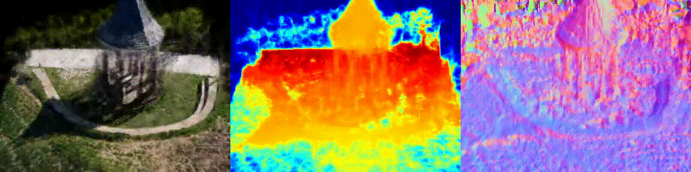|
|58f7f7299f5b5647873cb110 | neuralangelo-colmap_sparse||
|58f7f7299f5b5647873cb110 | neuralangelo-colmap_dense||
|59056e6760bb961de55f3501 | neus-colmap| 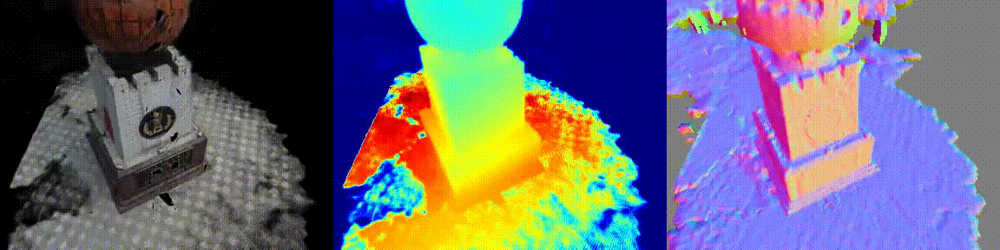|
|59056e6760bb961de55f3501 | neuralangelo-colmap_sparse||
|59056e6760bb961de55f3501 | neuralangelo-colmap_dense||
|5947719bf1b45630bd096665 | neus-colmap| |
|5947719bf1b45630bd096665 | neuralangelo-colmap_sparse||
|5947719bf1b45630bd096665 | neuralangelo-colmap_dense||
|5947b62af1b45630bd0c2a02 | neus-colmap| 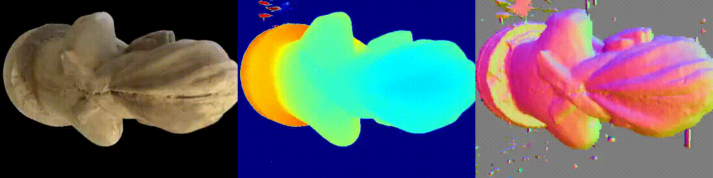|
|5947b62af1b45630bd0c2a02 | neuralangelo-colmap_sparse||
|5947b62af1b45630bd0c2a02 | neuralangelo-colmap_dense||
|59817e4a1bd4b175e7038d19 | neus-colmap| |
|59817e4a1bd4b175e7038d19 | neuralangelo-colmap_sparse||
|59817e4a1bd4b175e7038d19 | neuralangelo-colmap_dense||
|599aa591d5b41f366fed0d58 | neus-colmap| 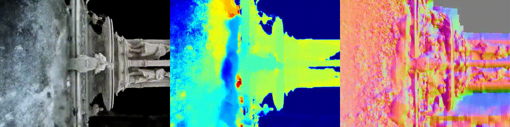|
|599aa591d5b41f366fed0d58 | neuralangelo-colmap_sparse||
|599aa591d5b41f366fed0d58 | neuralangelo-colmap_dense||
|59e75a2ca9e91f2c5526005d | neus-colmap| |
|59e75a2ca9e91f2c5526005d | neuralangelo-colmap_sparse||
|59e75a2ca9e91f2c5526005d | neuralangelo-colmap_dense||
|59f363a8b45be22330016cad | neus-colmap| 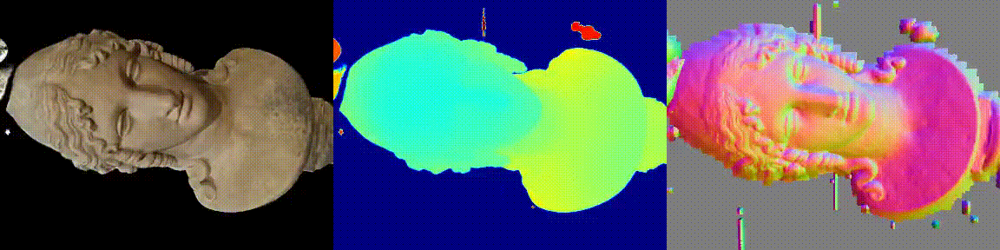|
|59f363a8b45be22330016cad | neuralangelo-colmap_sparse||
|59f363a8b45be22330016cad | neuralangelo-colmap_dense||
|59f87d0bfa6280566fb38c9a | neus-colmap| 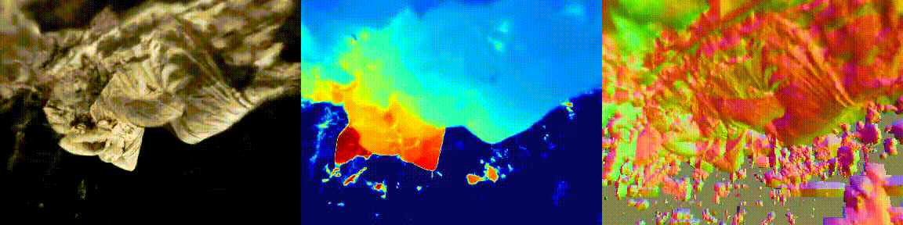|
|59f87d0bfa6280566fb38c9a | neuralangelo-colmap_sparse||
|59f87d0bfa6280566fb38c9a | neuralangelo-colmap_dense||
|5a48c4e9c7dab83a7d7b5cc7 | neus-colmap| 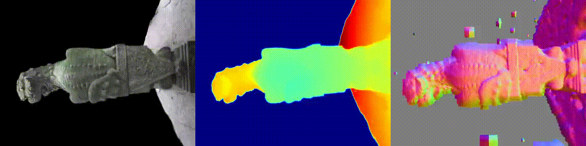|
|5a48c4e9c7dab83a7d7b5cc7 | neuralangelo-colmap_sparse||
|5a48c4e9c7dab83a7d7b5cc7 | neuralangelo-colmap_dense||
|5a588a8193ac3d233f77fbca | neus-colmap| |
|5a588a8193ac3d233f77fbca | neuralangelo-colmap_sparse||
|5a588a8193ac3d233f77fbca | neuralangelo-colmap_dense||
|5a8315f624b8e938486e0bd8 | neus-colmap| |
|5a8315f624b8e938486e0bd8 | neuralangelo-colmap_sparse||
|5a8315f624b8e938486e0bd8 | neuralangelo-colmap_dense||
|5aa0f9d7a9efce63548c69a1 | neus-colmap| |
|5aa0f9d7a9efce63548c69a1 | neuralangelo-colmap_sparse||
|5aa0f9d7a9efce63548c69a1 | neuralangelo-colmap_dense||
|5aa235f64a17b335eeaf9609 | neus-colmap| 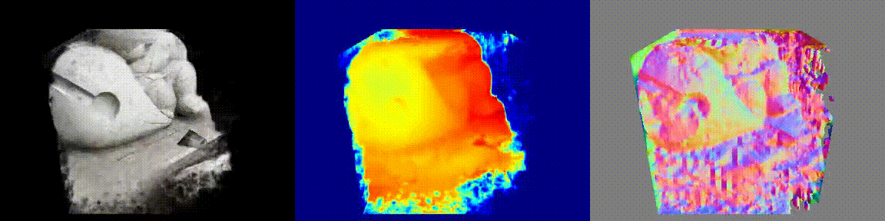|
|5aa235f64a17b335eeaf9609 | neuralangelo-colmap_sparse|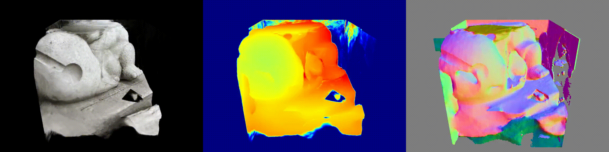|
|5aa235f64a17b335eeaf9609 | neuralangelo-colmap_dense|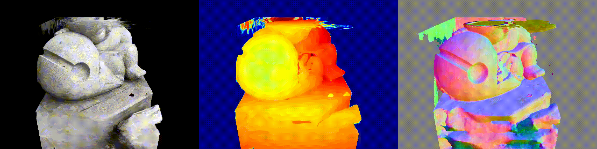|
|5aa515e613d42d091d29d300 | neus-colmap| 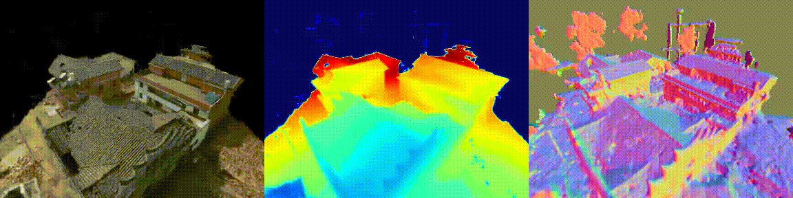|
|5aa515e613d42d091d29d300 | neuralangelo-colmap_sparse||
|5aa515e613d42d091d29d300 | neuralangelo-colmap_dense||
|5ab8713ba3799a1d138bd69a | neus-colmap| 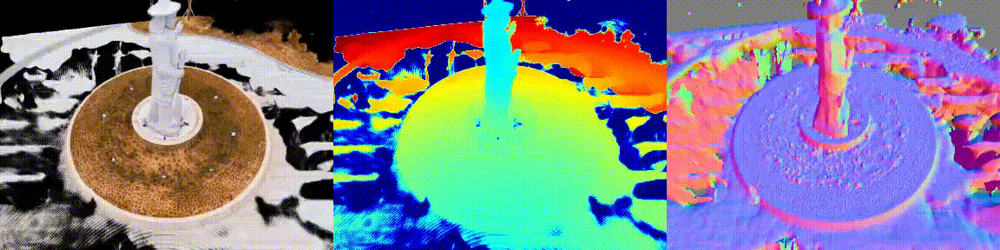|
|5ab8713ba3799a1d138bd69a | neuralangelo-colmap_sparse||
|5ab8713ba3799a1d138bd69a | neuralangelo-colmap_dense||
|5acf8ca0f3d8a750097e4b15 | neus-colmap| 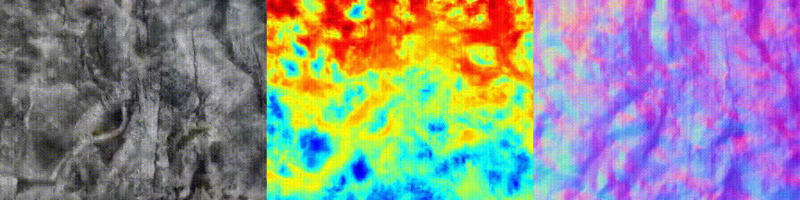|
|5acf8ca0f3d8a750097e4b15 | neuralangelo-colmap_sparse||
|5acf8ca0f3d8a750097e4b15 | neuralangelo-colmap_dense||
|5adc6bd52430a05ecb2ffb85 | neus-colmap| |
|5adc6bd52430a05ecb2ffb85 | neuralangelo-colmap_sparse||
|5adc6bd52430a05ecb2ffb85 | neuralangelo-colmap_dense||
|5afacb69ab00705d0cefdd5b | neus-colmap| |
|5afacb69ab00705d0cefdd5b | neuralangelo-colmap_sparse||
|5afacb69ab00705d0cefdd5b | neuralangelo-colmap_dense||
|5b08286b2775267d5b0634ba | neus-colmap| |
|5b08286b2775267d5b0634ba | neuralangelo-colmap_sparse||
|5b08286b2775267d5b0634ba | neuralangelo-colmap_dense||
|5b271079e0878c3816dacca4 | neus-colmap| 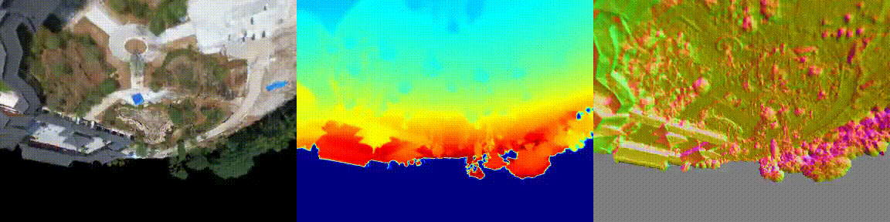|
|5b271079e0878c3816dacca4 | neuralangelo-colmap_sparse||
|5b271079e0878c3816dacca4 | neuralangelo-colmap_dense||
|5b558a928bbfb62204e77ba2 | neus-colmap| |
|5b558a928bbfb62204e77ba2 | neuralangelo-colmap_sparse||
|5b558a928bbfb62204e77ba2 | neuralangelo-colmap_dense||
|5b60fa0c764f146feef84df0 | neus-colmap| 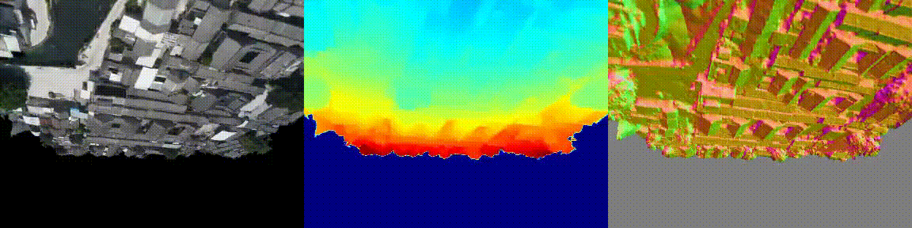|
|5b60fa0c764f146feef84df0 | neuralangelo-colmap_sparse|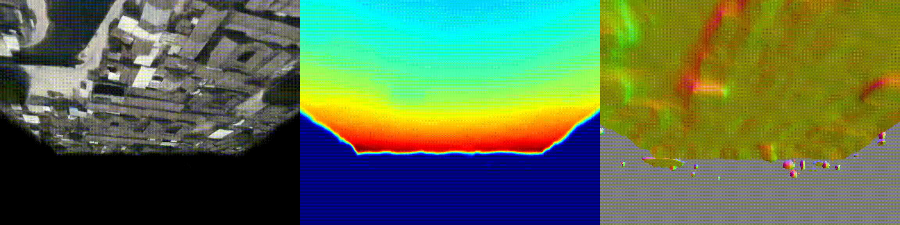|
|5b60fa0c764f146feef84df0 | neuralangelo-colmap_dense||
|5b62647143840965efc0dbde | neus-colmap| |
|5b62647143840965efc0dbde | neuralangelo-colmap_sparse||
|5b62647143840965efc0dbde | neuralangelo-colmap_dense||
|5b69cc0cb44b61786eb959bf | neus-colmap| |
|5b69cc0cb44b61786eb959bf | neuralangelo-colmap_sparse||
|5b69cc0cb44b61786eb959bf | neuralangelo-colmap_dense||
|5b6e716d67b396324c2d77cb | neus-colmap| 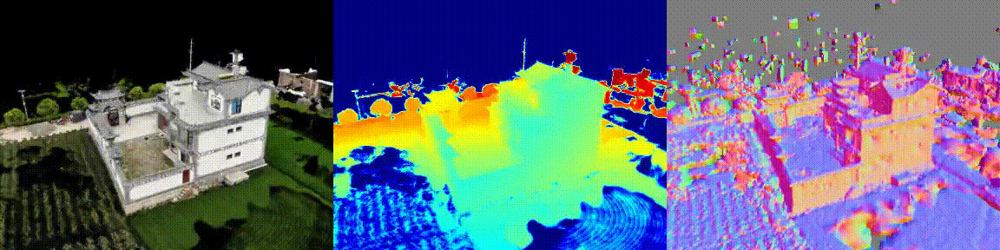|
|5b6e716d67b396324c2d77cb | neuralangelo-colmap_sparse||
|5b6e716d67b396324c2d77cb | neuralangelo-colmap_dense||
|5b6eff8b67b396324c5b2672 | neus-colmap| |
|5b6eff8b67b396324c5b2672 | neuralangelo-colmap_sparse||
|5b6eff8b67b396324c5b2672 | neuralangelo-colmap_dense||
|5b7a3890fc8fcf6781e2593a | neus-colmap| 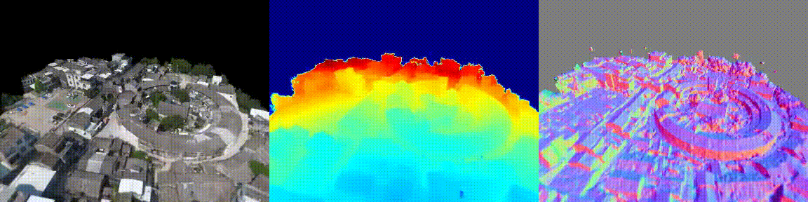|
|5b7a3890fc8fcf6781e2593a | neuralangelo-colmap_sparse||
|5b7a3890fc8fcf6781e2593a | neuralangelo-colmap_dense||
|5ba75d79d76ffa2c86cf2f05 | neus-colmap| |
|5ba75d79d76ffa2c86cf2f05 | neuralangelo-colmap_sparse||
|5ba75d79d76ffa2c86cf2f05 | neuralangelo-colmap_dense||
|5bbb6eb2ea1cfa39f1af7e0c | neus-colmap| 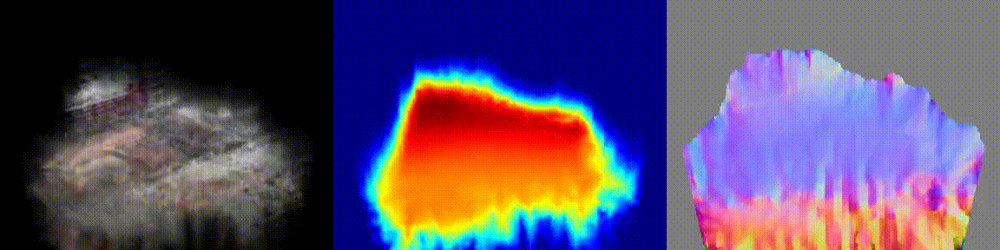|
|5bbb6eb2ea1cfa39f1af7e0c | neuralangelo-colmap_sparse||
|5bbb6eb2ea1cfa39f1af7e0c | neuralangelo-colmap_dense||
|5be3a5fb8cfdd56947f6b67c | neus-colmap| 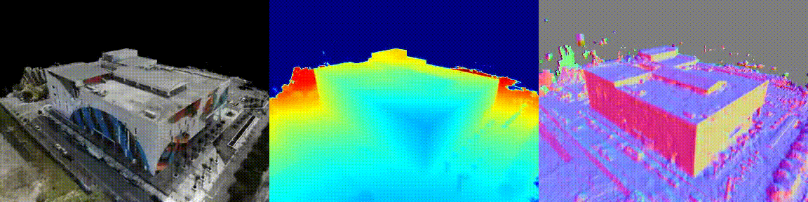|
|5be3a5fb8cfdd56947f6b67c | neuralangelo-colmap_sparse||
|5be3a5fb8cfdd56947f6b67c | neuralangelo-colmap_dense||
|5be3ae47f44e235bdbbc9771 | neus-colmap| 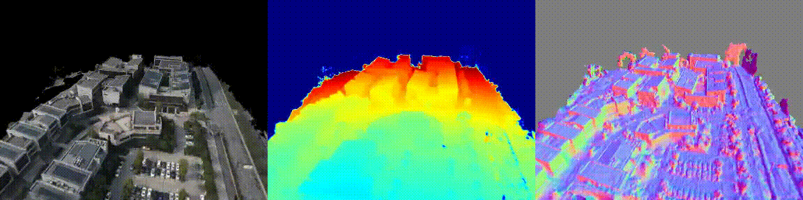|
|5be3ae47f44e235bdbbc9771 | neuralangelo-colmap_sparse||
|5be3ae47f44e235bdbbc9771 | neuralangelo-colmap_dense||
|5bf17c0fd439231948355385 | neus-colmap| 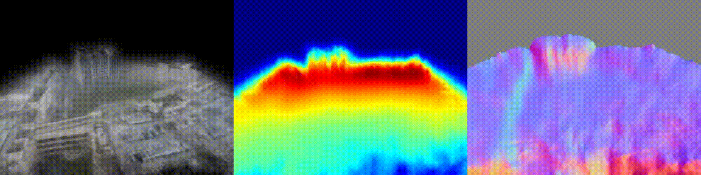|
|5bf17c0fd439231948355385 | neuralangelo-colmap_sparse||
|5bf17c0fd439231948355385 | neuralangelo-colmap_dense||
|5bf26cbbd43923194854b270 | neus-colmap| 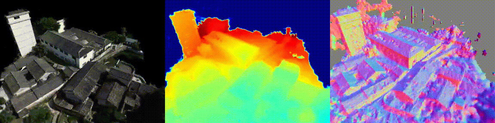|
|5bf26cbbd43923194854b270 | neuralangelo-colmap_sparse||
|5bf26cbbd43923194854b270 | neuralangelo-colmap_dense||
|5bfc9d5aec61ca1dd69132a2 | neus-colmap| |
|5bfc9d5aec61ca1dd69132a2 | neuralangelo-colmap_sparse||
|5bfc9d5aec61ca1dd69132a2 | neuralangelo-colmap_dense||

## Tanks and Temples
To be comming soon

## Scannet & Scannet++
To be comming soon

## Custom Data
To be comming soon

# Know Issue

# How to contribute
